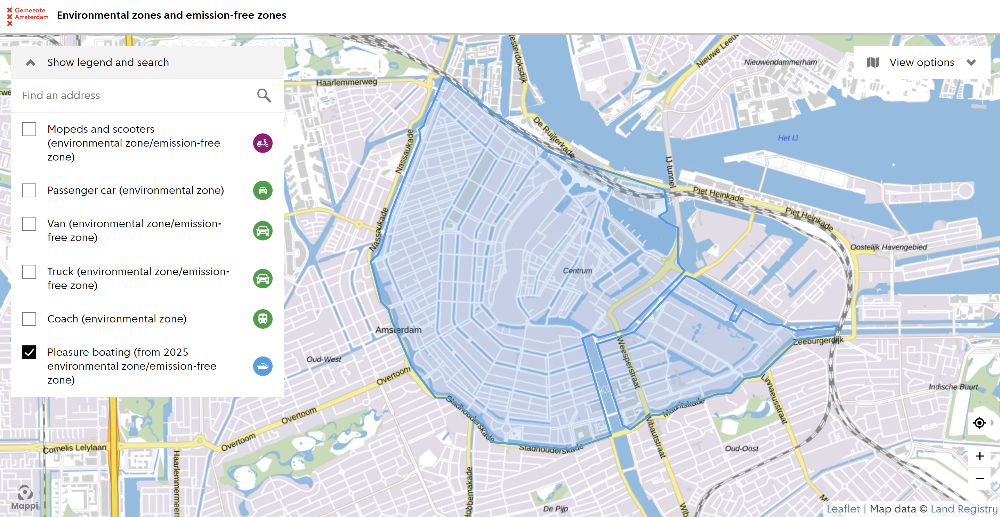

<frontmatter>
  title: Water Quality
</frontmatter>

 

# Water Quality

## First assignment

### This first assignment is focused on the pollution levels of the water in the canals and the different formats of data available. 

As a preliminary statement it is important to say that since the Amsterdam canals are not official bathing sites, water quality in them is not tested.

Find below the different **parameters** that we came up with in regards to water pollution levels along with the **relevant available sources** (if existant) of information and their **formats**.

**Safety for swimmers**

| # | Parameter | Explanation | Source | Format
|:-|:-|:-|
1. | Pollution levels in Herensgracht and Prinsengracht | Chemical composition of the water | [Study](https://www.rivm.nl/publicaties/microbiologische-kwaliteit-van-grachtenwater-in-amsterdam) | Journal
1. | Pollution levels in swimming locations | Chemical levels in swimming locations in 2019 with interpreted data | [Dataset](https://onderzoek.amsterdam.nl/dataset/water-in-amsterdam) | Excel
1. | Places with sensors available. |
1. |Historical data for water quality. |

**Factors affecting the quality of water**

2. Sewage overflow points https://data.overheid.nl/dataset/xnhveaeyheww2w#panel-resources 
2. Sewage pipes https://geodata.nationaalgeoregister.nl/rioned/gwsw/wfs/v1_0?request=GetFeature&service=WFS&version=1.1.0&outputFormat=application%2Fjson&typeName=gwsw:beheer_leiding
2. Flows/currents
2. Physical factors of the water. Temperature, visibility, depth.

